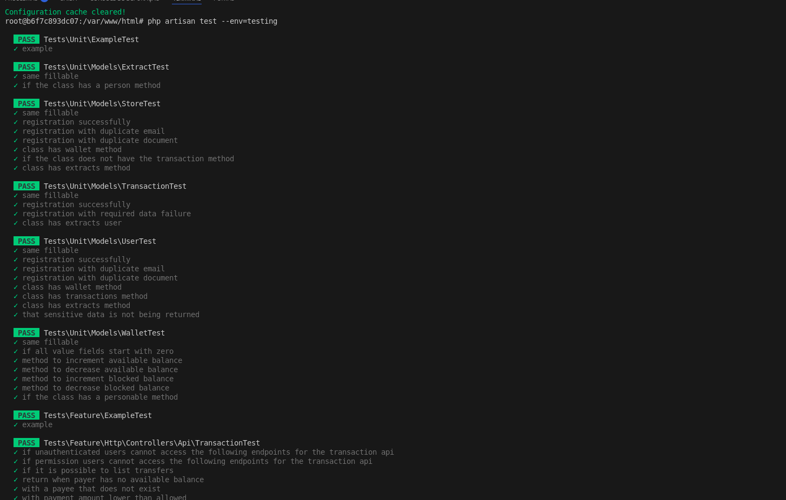
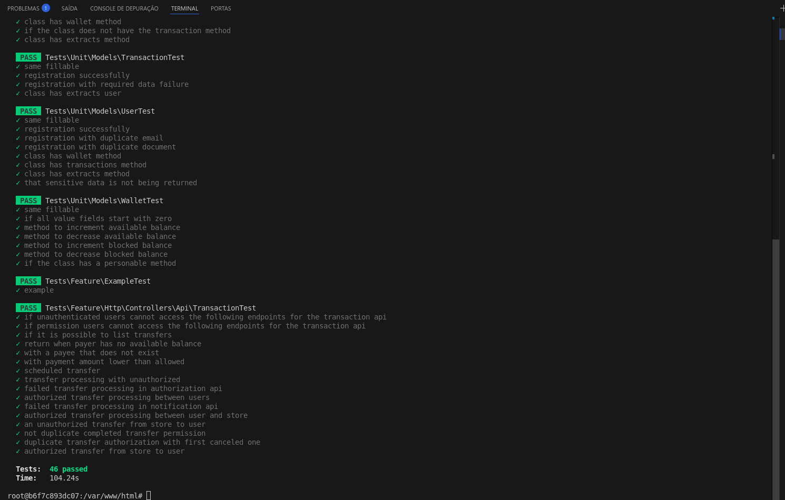
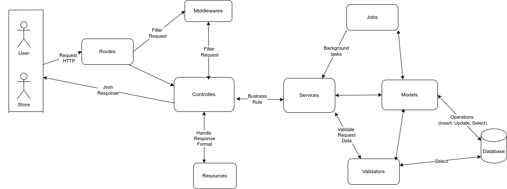
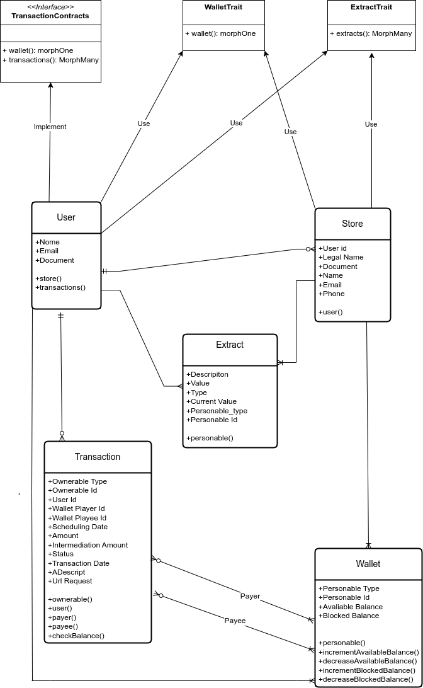
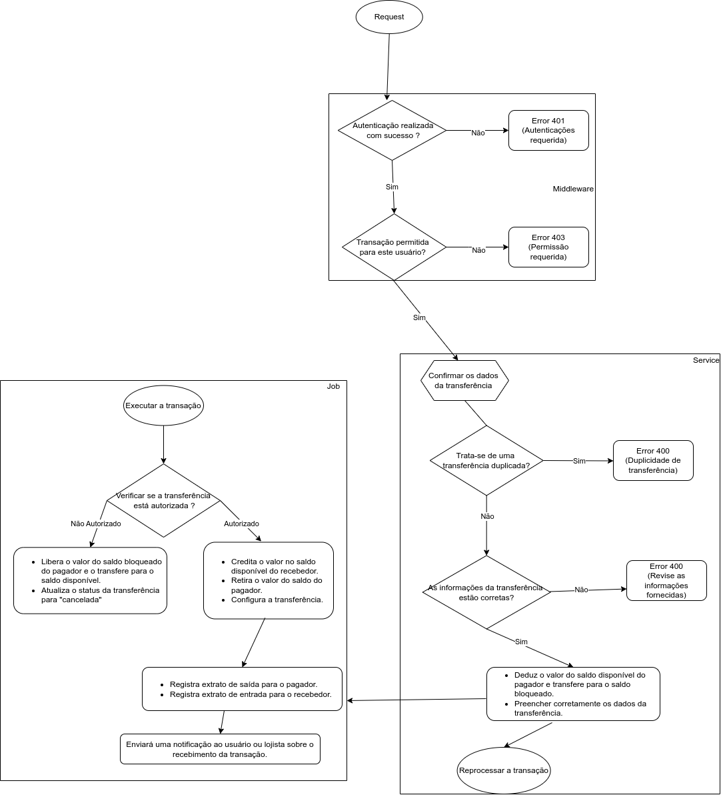
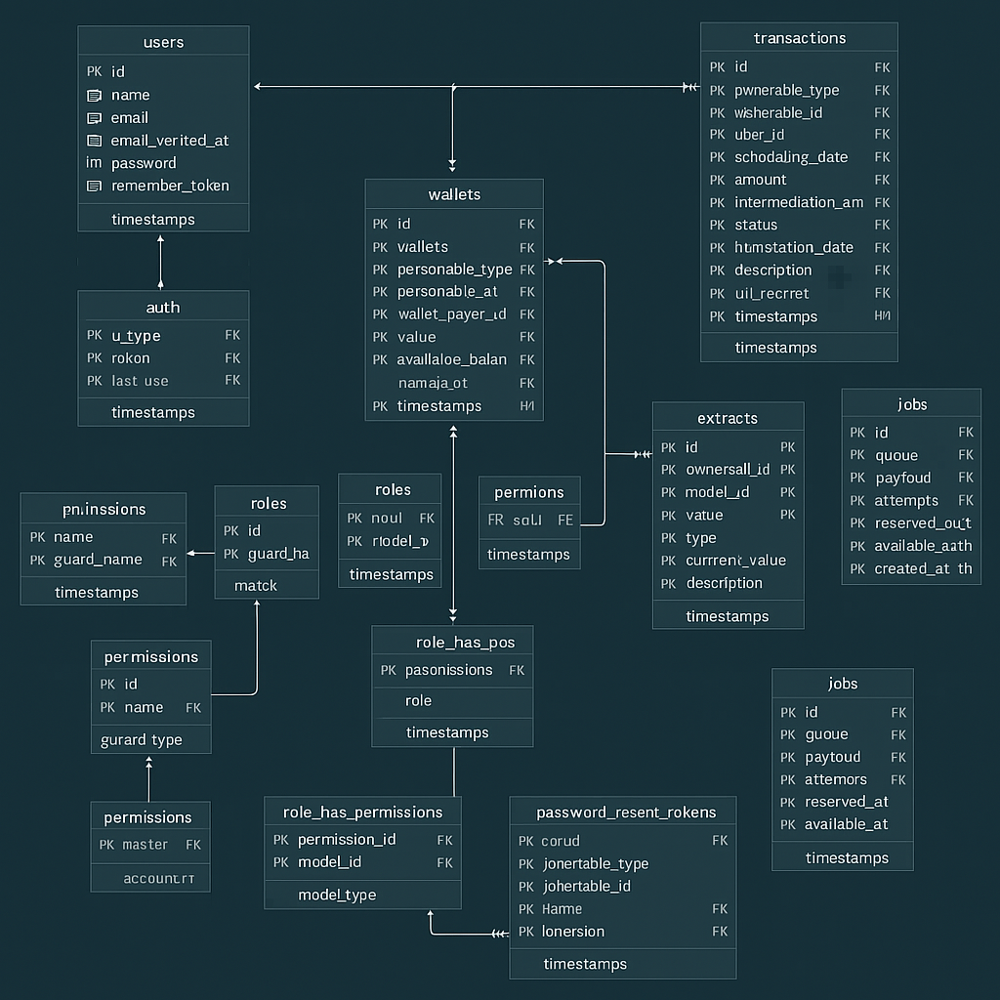

## Como baixar e executar o projeto

Siga os passos abaixo para configurar e executar o projeto localmente:

### 1. Clone o repositório

```bash
git clone https://github.com/themarcosramos/Simplified
```

### 2. Acesse a pasta do projeto

```bash
cd Simplified/
```

### 3. Suba os containers com Docker

```bash
docker-compose up -d --build
```

### 4. Verifique o estado dos containers

```bash
docker-compose ps
```

### 5. Configure os arquivos de ambiente

```bash
cp .env.example .env
cp .env.testing.example .env.testing
```

### 6. Acesse o container da aplicação

```bash
docker exec -it laravel-app bash
```

### 7. Instale as dependências PHP

```bash
composer install
```

### 8. Em um novo terminal, acesse o container do banco de dados

```bash
docker exec -it laravel-db mysql -uroot -proot
```

### 9. Verifique se os bancos de dados foram criados

No console MySQL, digite:

```sql
SHOW DATABASES;
```

Confirme se existem os bancos:

- `transferdb`
- `transferdb_testing`

Depois, saia do MySQL com:

```sql
exit;
```

### 10. Gere a chave da aplicação

De volta ao container da aplicação:

```bash
php artisan key:generate
```

### 11. Rode as migrations e seeders

```bash
php artisan migrate --seed
```

### 12. Instale o Passport

```bash
php artisan passport:install
```

### 13. Inicie o servidor Laravel

```bash
php artisan serve --host=0.0.0.0 --port=8000
```

> O servidor estará acessível em:
> - http://localhost:8000 (a partir do navegador da sua máquina)
> - http://0.0.0.0:8000 (internamente no container ou para testes em rede)


### 14. (Opcional) Limpe o cache de configuração e rode os testes

No container da aplicação:

```bash
php artisan config:clear
```
```bash
php artisan test --env=testing
```
---

## Lista de Testes Automatizados

###  [Planejamento de testes](doc/tests/listaTestes.md)

### Screenshot dos teste 





## Diagrama
### Arquitetura de software


##### [Arquitetura de software em xml](doc/xml/software_architectural_diagram.drawio.xml)

### Classe 


#####  [Classe em xml](doc/xml/ClassDiagram.drawio.xml)

### Fluxo de processo

##### [Fluxo de processoem xml](doc/xml/process_flow_diagram.drawio.xml)

### Banco de dados



## Pacotes do Laravel usa

### [Passport](https://laravel.com/docs/8.x/passport)
### [Permission](https://spatie.be/docs/laravel-permission/v4/prerequisites)
### [Auditing](http://www.laravel-auditing.com/)

##  Setup do Postman para testes da API

### [Collection](doc/postman/TransfersAPI.postman_collection.json)
### [Environment](doc/postman/TransfersAPI.postman_environment.json)


## License

The [Laravel framework](https://laravel.com) is open-sourced software licensed under the [MIT license](https://opensource.org/licenses/MIT).
